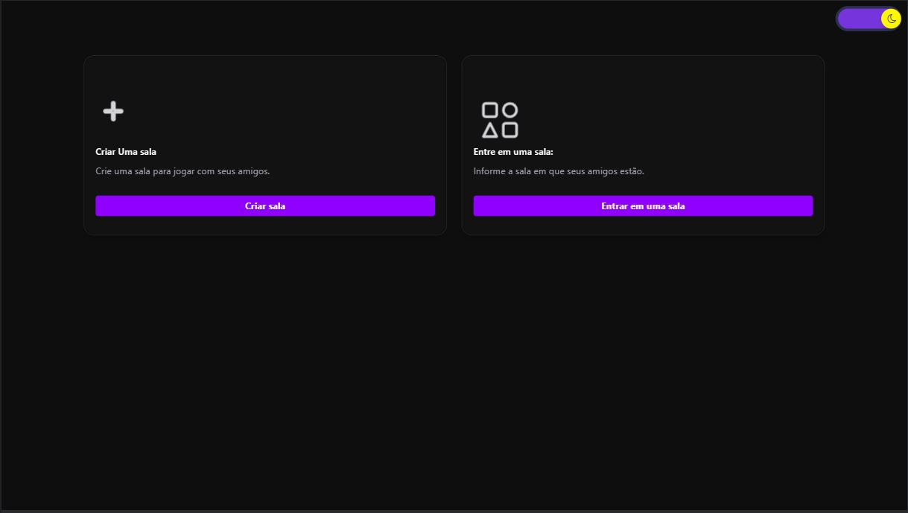
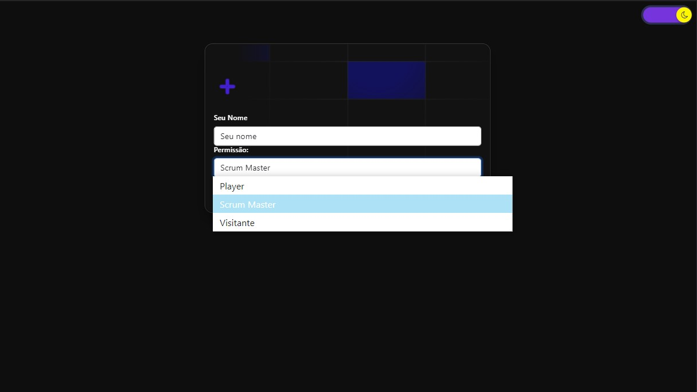
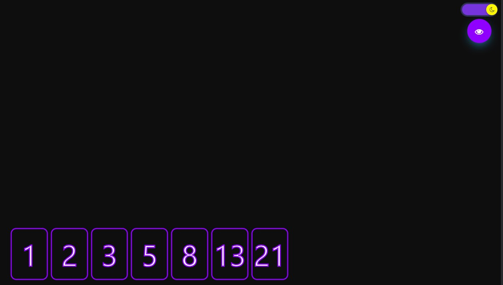
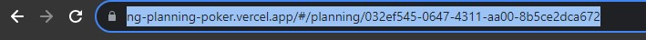
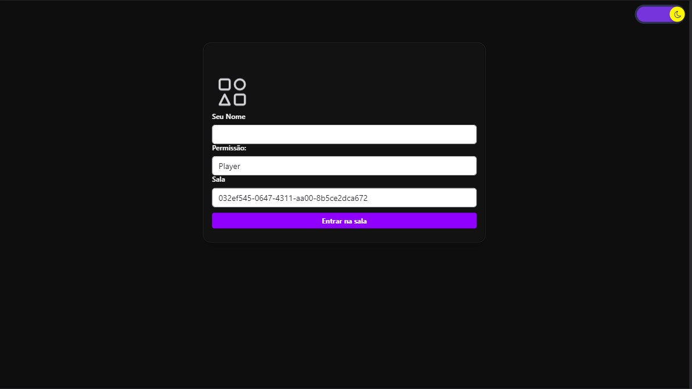
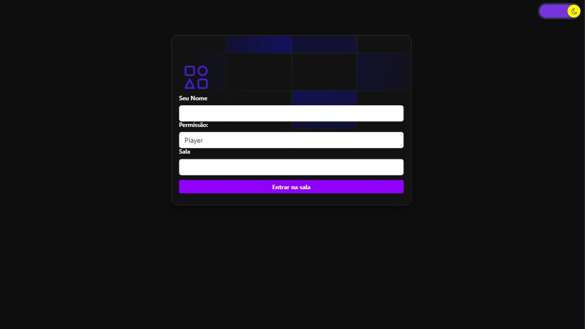
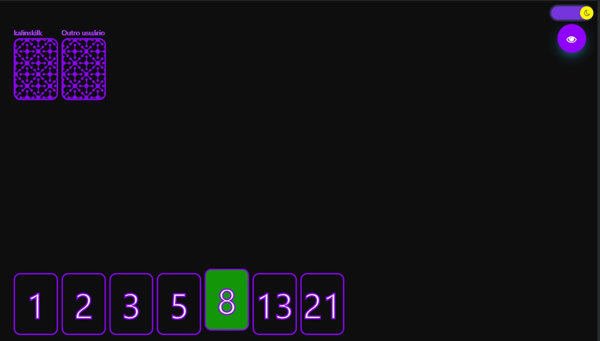
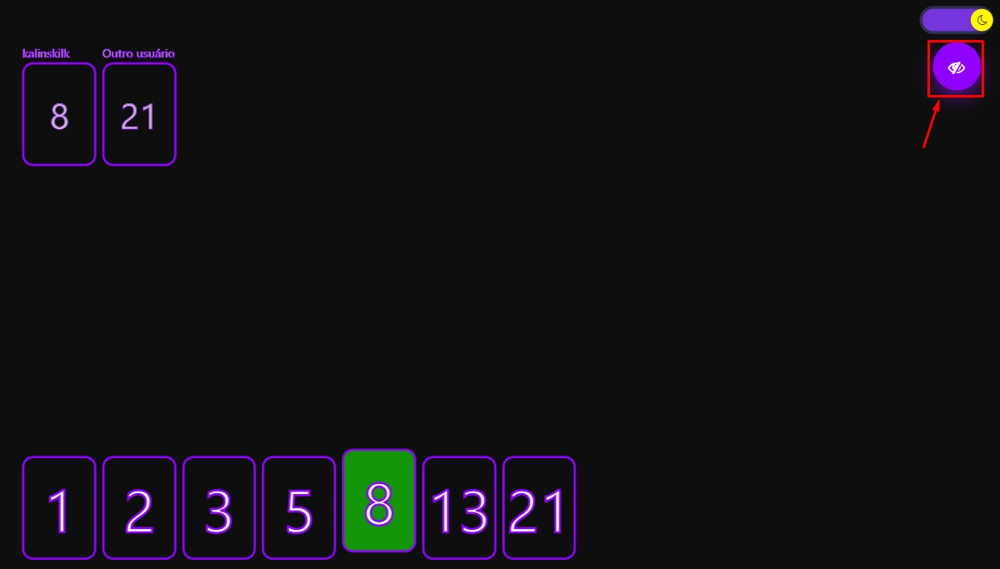
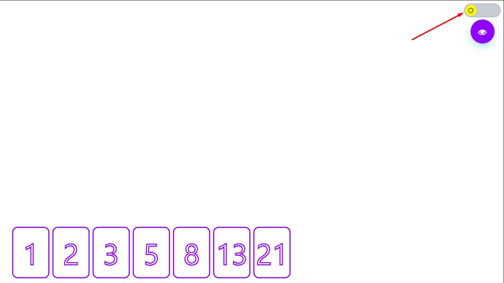

## CI/CD

  &nbsp;

# O que é isso?

Uma aplicação simples de planning poker para auxiliar na sua metodologia ágil.

# Demo Vercel app

Acesse: https://ng-planning-poker.vercel.app/#/

_Obs: Usamos um servidor gratuito com sleeping._

## Repositório do Servidor

https://github.com/kalinskilk/node-planning-poker

## Como usar

- Instale as depencias utilizado `npm install` ou `yarn install`

- Faça o mesmo para o servidor

- Execute o comando `npm start` ou `yarn start` tanto para o servidor como para o client

# Como funciona?

Acesse: `http://localhost:4200`

## Como criar uma nova sala

Crie uma sala

Informe seu nome de usuário e escolha sua permissão no jogo. Salve.

Pronto agora basta compartilhar o link com seus colegas e jogar.

## Como entrar em uma sala

Você pode fazer de duas formas. Acessando um link com uma room id
ou tendo a room id.

### Acessando via link

Se for a sua primeira vez acessando você vera esta tela.

Basta informar seu nome e entrar na sala.

### Acessando via room id

Para entrar em uma sala, acesse a tela inicial e clique em entrar em uma sala.

Em seguida informe seu nome e o código da sala. Depois clique em entrar na sala.

# Jogando

- Regra: ao menos um jogador precisar ser scrum master para poder virar as cartas.

Para votar na sua pontuação basta clicar nos cards abaixo.

Para virar as cartas basta clicar no botão flutuante com icone de olho.

Para reiniciar a votação basta clicar no mesmo botão.

# Dark e Light theme

Caso queira você pode optar pelo modo dark ou light theme. Basta clicar no botão de alteração de tema.

# LIBS Utilizadas

Framework Front-end: `Angular`

Toast: `ngx-toastr`

Socket: `ngx-socket-io`

Design: `Bootstrap`

Animations: `angular-animations`
